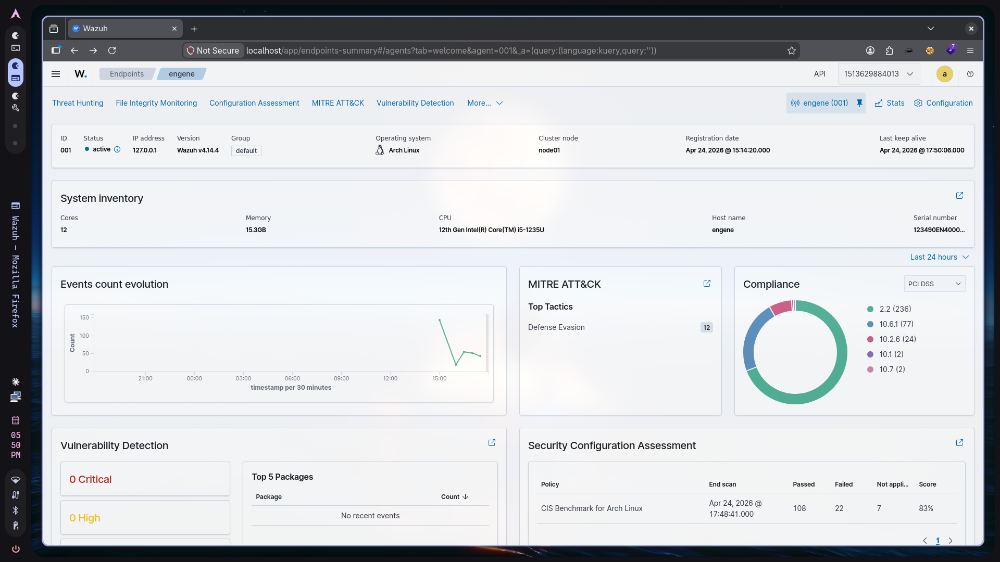
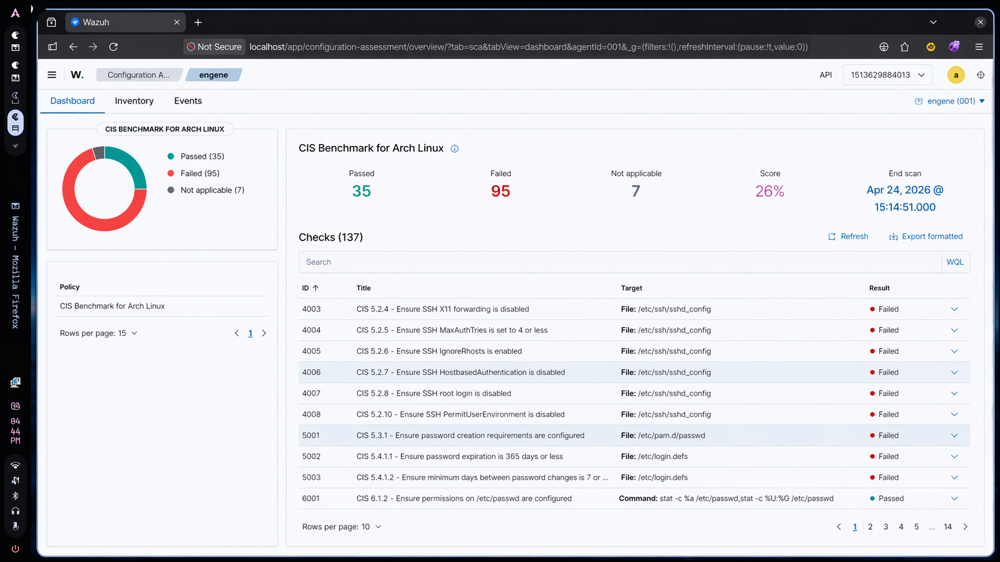
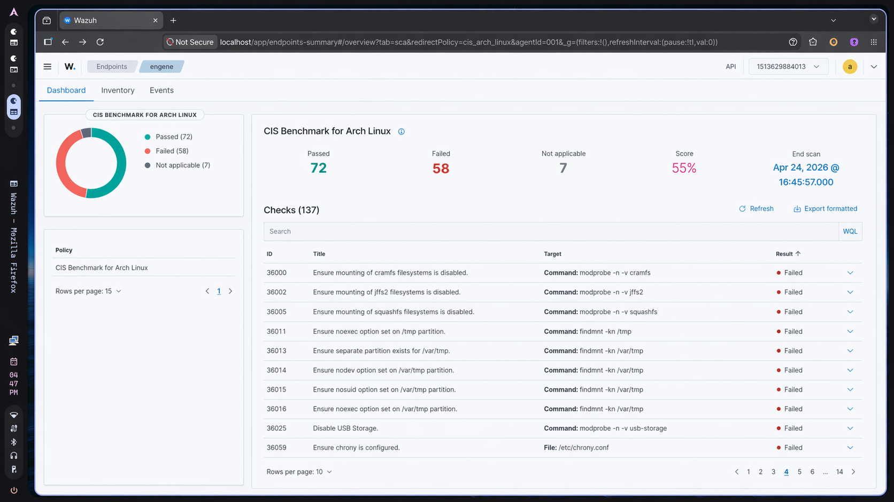
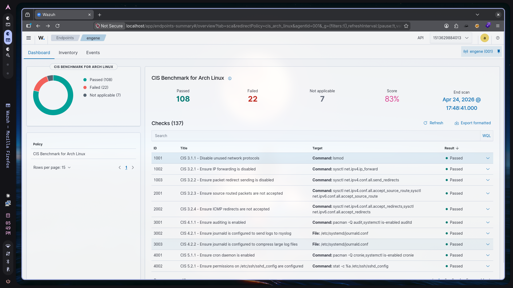

# 🛡️ Linux Infrastructure Hardening & SIEM Orchestration

### **Compliance Status:** `83%` | **Baseline:** `26%`
**Framework:** CIS Arch Linux Benchmark v3.0.0  
**Project Type:** Endpoint Security Engineering & Compliance Hardening

---

## 1. Executive Summary
This project documents the systematic hardening of an Arch Linux endpoint from a vulnerable baseline to a production-hardened state. By integrating the **Wazuh SIEM/XDR** stack and following the **CIS (Center for Internet Security)** framework, I remediated 100+ misconfigurations. 

The result is a "Fortified Sentinel"—a host designed with a minimal attack surface and high-fidelity telemetry, providing real-time visibility into kernel-level events and MITRE ATT&CK-aligned threats.

---

## 2. Technical Stack
* **Target OS:** Arch Linux (Rolling Release)
* **SIEM/XDR:** Wazuh v4.14.4 (Docker-based Manager)
* **Instrumentation:** Linux Audit Framework (`auditd`), `libpwquality`
* **Hardening Controls:** `pam_pwquality`, `systemd`, `sysctl`, `visudo`, `ip6tables`
* **Automation:** Fish Shell (Custom remediation scripting)

---

## 3. Security Orchestration & Monitoring
Wazuh served as the centralized Security Configuration Assessment (SCA) engine. Beyond scoring, it provided real-time alerting for file integrity changes and unauthorized system modifications.

*Figure 1: Centralized Security Dashboard showing active telemetry and SCA compliance.*

---

## 4. Implementation Phases

### Phase 1: Baseline Assessment
The initial environment represented a "Day Zero" installation. The first SCA scan established a baseline score of **26%**, revealing significant gaps in:
* **Identity Management:** Weak password complexity and unmonitored `sudo` activity.
* **Kernel Security:** Unrestricted module loading and insecure network parameters.
* **Logging:** Lack of granular audit trails for sensitive file access.

*Figure 2: Initial scan results showing 95 failed security checks.*

### Phase 2: Remediation Sprints
Remediation was executed in logical "Sprints" to ensure system stability while increasing security posture.

#### **Sprint A: Identity & Access Management (IAM)**
* **Sudo Hardening:** Enforced `use_pty` and directed logs to `/var/log/sudo.log` for immutable command tracking.
* **Privilege Restriction:** Limited administrative escalation to the `wheel` group via `pam_wheel.so`.
* **Credential Policy:** Implemented password aging and complexity requirements via `login.defs` and `pam_pwquality`.

#### **Sprint B: Filesystem & Kernel Protections**
* **Mount Security:** Applied `noexec`, `nosuid`, and `nodev` flags to `/tmp`, `/var/tmp`, and `/dev/shm`.
* **Module Hardening:** Blacklisted legacy/dangerous filesystems (CramFS, JFFS2, HFS) and restricted unauthorized USB storage drivers via `modprobe.d`.

*Figure 3: Mid-project progress (55%) following kernel and filesystem remediation.*

#### **Sprint C: Network Surface Reduction**
* **Service Masking:** Physically "masked" legacy services (FTP, Telnet, SNMP, HTTP) to prevent accidental activation.
* **Stack Hardening:** Configured `sysctl` to disable IP forwarding, ignore ICMP redirects, and reject source-routed packets.

### Phase 3: High-Fidelity Auditing (The Telemetry Engine)
To reach the final compliance tier, I expanded host-level visibility using `auditd`. I deployed **22,000+ rules** (Neo23x0 baseline) to monitor:
* **`-k modules`**: Kernel module tampering (Rootkit detection).
* **`-k scope`**: Any modification to `sudoers` or administrative boundaries.
* **`-k file_creation`**: Monitoring restricted directories for suspicious drops.

---

## 5. Key Results
* **Compliance Velocity:** Successfully increased the SCA score by **57 percentage points**.
* **Detection Capability:** Established a telemetry pipeline that maps raw kernel events to **MITRE ATT&CK** tactics.
* **Reduced Vulnerability:** Eliminated common vertical privilege escalation paths.

*Figure 5: Final SCA report reflecting 83% compliance.*

---

## 6. Lessons Learned
* **Minimalism vs. Security:** Arch Linux's lean nature provides a smaller attack surface, but requires manual engineering to meet enterprise compliance standards.
* **The Value of SCA:** Continuous assessment is critical; remediation is not a one-time event but a cycle of "fix, scan, and validate."

---

### 📝 Project Completion Checklist
- [x] Deploy Wazuh SIEM
- [x] Agent Instrumentation & Enrollment
- [x] Kernel & Filesystem Hardening
- [x] High-Fidelity Auditd Rule Deployment
- [x] Final CIS Validation (80%+)
